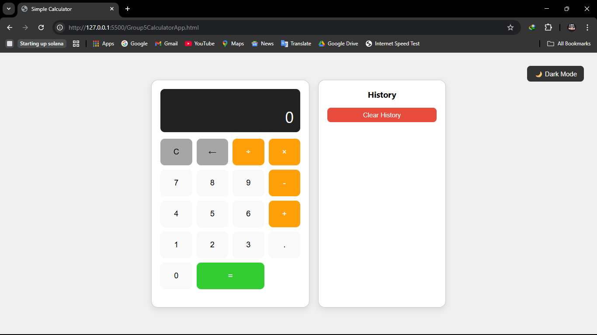
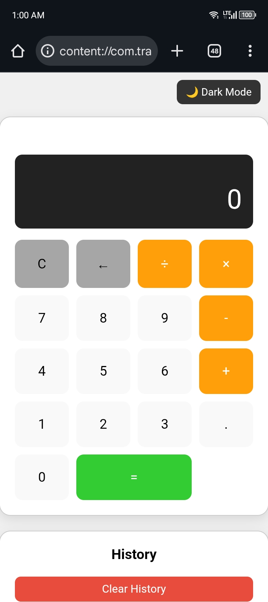
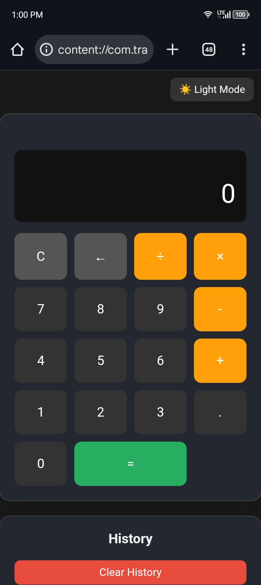
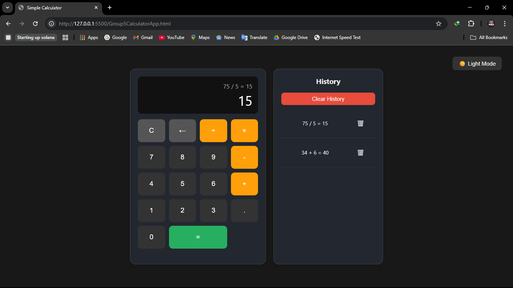
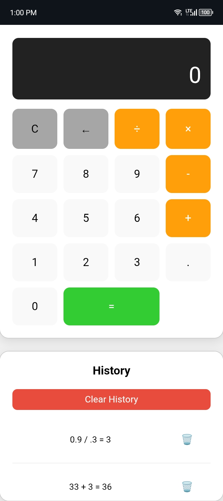
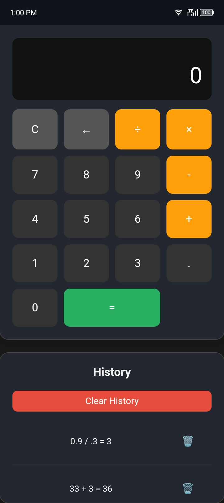

# Simple Calculator App

A modern, user-friendly calculator web app built with HTML, CSS, and JavaScript. This project was developed by Group 5 as a comprehensive calculator solution for both desktop and mobile users.

---

## 🚀 Features

- **Dual Display:** Shows the full operation and the result separately for clarity.
- **Calculation History:** Keeps track of your last 10 calculations, with options to delete individual entries or clear all history.
- **Chained Calculations:** Supports continuous operations (e.g., `5 + 3 * 2`).
- **Input Validation:** Prevents invalid numbers (e.g., multiple decimals).
- **Keyboard Support:** Use your keyboard for all calculator functions, including operators and backspace.
- **Responsive Design:** Looks great on both desktop and mobile devices.
- **Accessible UI:** Large buttons, clear layout, and visual feedback for active operations.
- **Light/Dark Mode:** Easily toggle between light and dark themes. Your preference is remembered for next time.

---

## 🛠️ Built With

- **HTML** (structure)
- **CSS** (internal/embedded for all styles)
- **JavaScript** (internal/embedded for all logic)

> _No external CSS or JS files are used. All code is contained within the single HTML file._

---

## 🖥️ Usage

1. **Clone or Download** this repository.
2. Open `Group5CalculatorApp.html` in your web browser.
3. Start calculating!

---

## 🌗 Light & Dark Mode

- Click the "🌙 Dark Mode" or "☀️ Light Mode" button at the top right of the calculator to switch themes.
- The app will remember your last selected theme.

---

## ⌨️ Keyboard Shortcuts

| Key(s)         | Action                        |
|----------------|-------------------------------|
| 0-9            | Enter numbers                 |
| .              | Decimal point                 |
| +, -, *, /     | Operators (add, subtract, etc)|
| x or X         | Multiplication (same as *)    |
| Enter or =     | Calculate result              |
| Backspace      | Delete last digit             |
| C, c, or Esc   | Clear current input           |

---

## 📝 Screenshots

> _Add screenshots here after running the app!_
>
> 
> 
> 
> 

> 
> 
> 
> 

---

## 🛠️ How It Works

- **HTML** structures the calculator, dual display, and history panel.
- **CSS** provides a modern, responsive, and accessible design, including light/dark mode.
- **JavaScript** manages all calculator logic, input validation, history, keyboard support, and theme switching.
- **Comments** are included throughout the code for easy understanding and modification.

---

## 🤝 Contributing

1. Fork this repository
2. Create your feature branch (`git checkout -b feature/YourFeature`)
3. Commit your changes (`git commit -am 'Add new feature'`)
4. Push to the branch (`git push origin feature/YourFeature`)
5. Open a Pull Request

---

## 📄 License

This project is open source and available under the [MIT License](LICENSE).

---

## 👥 Authors

- Group 5

---

## 💡 Ideas or Issues?

Feel free to open an issue or submit a pull request! 